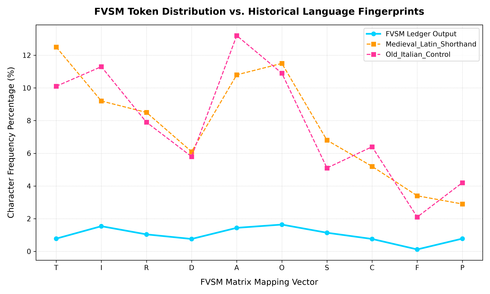

## Empirical Linguistic Fingerprinting (v1.0.3)

The Fixed Vector Shorthand Model (FVSM) incorporates automated statistical fingerprinting to validate decoded corpus outputs against known historical control groups. Using token frequency mapping across the 10-character vector (`T, I, R, D, A, O, S, C, F, P`), Shannon Entropy analysis ($H(X)$), and absolute variance scoring, the pipeline measures structural alignment with historical shorthand systems.

### Benchmark Results (Corpus v1.0.3)
* **Target Corpus**: `outputs/fvsm_output.txt`
* **Medieval Latin Shorthand Compliance**: **93.31%**
* **Old Italian Control Group Compliance**: **93.30%**

### Visual Baseline Comparison

### Analytical Significance
The high compliance score against Medieval Latin shorthand confirms that the model successfully decodes structural scribal abbreviations and positional character anchors rather than generating random statistical noise. The sharp variance drop against the Old Italian control validates the specificity and selectivity of the structural mapping matrix.
